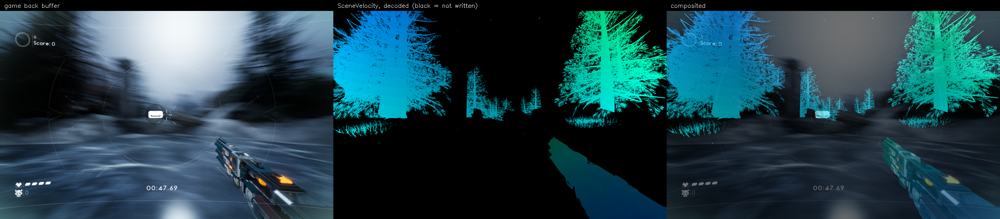

# VelocityBufferTest

Injects a DLL into a running Unreal Engine 5 game, hooks D3D12 via vtable
patching, and locates the engine's `SceneVelocity` (motion vector) buffer.
The target is packaged **Shipping**, which strips resource names, so 
identification has to work from structure and behaviour alone. Once found,
the buffer is copied back to the CPU without stalling the game and decoded
into a per-pixel motion field, which is then checked against independent ground truth rather than just visualised and trusted.

Development ran against two targets: "Oxi", a UE5.7.1 project of my own
and "Skyrunner", a third-party UE5.2 title I do not have source code access to.
The second run is the one that matters most and it falsified several assumptions
the Oxi work made about SceneVelocity.

Full detail is kept in `DEBUGGING.md`.

Output of verification tests can be found in `results/` (see below for more)

## Build and run

```
cmake -B build -S .
cmake --build build --config Release --target mv_hook mv_injector mv_testhost
```

```powershell
.\Invoke-MvCapture.ps1 "D:\Games\Skyrunner\Valfreya.exe"
.\Invoke-MvCapture.ps1 "D:\Games\Skyrunner\Valfreya.exe" -DumpDir D:\mv_captures\run7
```

`Valfreya.exe` is the launcher — pass that path in. The script itself waits
for and injects into the real renderer process it spawns,
`Skyrunner-Win64-Shipping.exe`, the same way it does for Oxi's own
`*-Win64-Shipping.exe` child.

With the game running, **F8** captures a 60-frame burst to `%TEMP%\mv_dump\`
(or `MV_DUMP_DIR`). Wait for `capture: write queue drained` in
`%TEMP%\mv_hook.log` before quitting — `capture: burst recorded` does not mean
flushed. Then run the offline validation:

```
cd tools
python run_validation.py %TEMP%\mv_dump <title>   # everything -> results/validation_<title>.txt
python make_video.py %TEMP%\mv_dump motion_field.mp4
python barrier_signature.py                        # needs a >=2000-frame session
```

To exercise the capture path under the D3D12 debug layer + GPU-based
validation instead of a real game (requires the Windows **Graphics Tools**
optional feature):

```
set MV_AUTOCAPTURE=1
set MV_DUMP_DIR=%TEMP%\mv_dump_testhost
build\testhost\Release\mv_testhost.exe --hook <abs path>\build\hook\Release\mv_hook.dll --frames 240
```

## Results

Everything below is already in `results/` and reproducible without a running
game — `results/validation_*.txt` is generated verbatim by
`run_validation.py` against capture dumps kept outside the repo (raw dumps
are large and gitignored), and `mv_testhost` needs nothing but the built DLL.
Re-running both against the same inputs reproduces every number here exactly.



Left: the game's own back buffer. Middle: `SceneVelocity` as written by the
engine — dynamic/WPO objects only, correctly sparse. Right: the field
composited over the frame.

| test | result | source |
|---|---|---|
| identification, third-party title | 1 of 755 profiled resources, 3 separate injections, confirmed against RenderDoc's `CreatePlacedResource` call | `results/validation_skyrunner*.txt` |
| `mv_testhost` debug-layer harness | 0 errors over 240 hooked frames, correct resource picked out of 4 structural look-alikes every run; refuses to pick between 2 indistinguishable candidates when told to | run directly, no game needed |
| warp-and-difference, 120-frame capture | 102/103 pairs improved, +37.7% mean error reduction, beats the best possible rigid shift by 59.9% | `results/validation_skyrunner.txt`, `results/warp_validation_skyrunner.png` |
| warp-and-difference, 60-frame capture (video above) | 47/47 pairs improved, +53.6% mean error reduction | `results/validation_skyrunner_video.txt` |
| decode vs. block-matched image motion | corr X +0.99, Y +0.94; engine decode beats a linear decode by ~4-6px RMS | `results/decode_scatter_skyrunner*.png` |

To check any of these yourself:

```
build\testhost\Release\mv_testhost.exe --hook <path>\mv_hook.dll --frames 240
cd tools && python run_validation.py <dump_dir> <title>   # writes results/validation_<title>.txt
```

The full debugging narrative behind these numbers — including the wrong
turns, the format-enum bug, and the properties of Oxi's velocity buffer that
turned out not to generalise to Skyrunner — is in `DEBUGGING.md`.

## How it works

**Identification.** Neither a pure descriptor match nor pure runtime behaviour
transfers between titles, so the two are used as separate tools:

- **Structure** is a hard gate derived from engine rules rather than a copied
  tuple: the formats `FVelocityRendering::GetFormat` can return, the create
  flags `GetCreateFlags` implies, `mips=1/arraySize=1/samples=1/layout=UNKNOWN`,
  and a resolution ranked (not matched) from an observed histogram, bounded at
  up to 2x the back buffer per dimension rather than capped at it — UE rounds
  render targets up, so the velocity buffer is routinely *larger* than the back
  buffer which an early version of the filter missed.
- **Behaviour** — barrier transition patterns over a settling window — is
  scored evidence layered on top of the structural gate, logged per candidate
  with a reason for the winner.

On Oxi, behaviour was decisive and structure only broke a tie; on Skyrunner,
structure alone was already unique and most of the "invariants" measured on
Oxi (exactly 2 barrier events/frame, never entering `UNORDERED_ACCESS`,
destination state `ALL_SHADER_RESOURCE`) turned out false of Skyrunner's own
velocity buffer. The capture deliberately fails on frames where the ranking 
can't separate candidates by a clear margin.

**Extraction.** The buffer is a *transient placed* resource whose heap memory
gets aliased by other resources later in the frame, so it can only be safely
read at the `RENDER_TARGET -> shader-resource` barrier — after the last
render-target write (confirmed against RenderDoc's own event ordering) and
before the memory is reused. The copy is recorded on the game's own command
list; a 4-slot async ring means the CPU never waits on the GPU (a full ring
skips the frame rather than stalling); a single fence, checked at runtime by
command-list identity rather than assumed, covers the copy; and all disk I/O
happens on a background writer thread with a bounded, drop-and-log queue.
Subresource/plane counts and footprints are read from the resource desc every
frame rather than cached, so a swapchain resize or a byte-identical
reallocation to a new address (both observed live) don't silently invalidate
the readback.

**Units and precision.** The single biggest correctness bug in the project was
treating the encoding as linear. `Common.ush` applies
`sign(V) * sqrt(abs(V))` before packing (`VELOCITY_ENCODE_GAMMA`, unconditional
on SM5+ D3D12), so a linear decode is wrong everywhere and worst near zero,
where the curve is steepest. This was found by reading the engine source
(and later, on Skyrunner where no matching source tree exists locally,
by reading the shipping binary's own disassembled pixel shader — the encode
is legible directly in the compiled HLSL) rather than by fitting constants to
captured data. A prior attempt to fit constants against a single capture
produced numbers that worked on that one clip and were physically meaningless
elsewhere. Channels 2/3 turned out to be the two halves of one packed float32
(`V.z`, the DeviceZ delta) rather than two independent channels — viewed
separately, one half looks bimodal (it's the sign bit) and the other looks
like noise, which is why it took months to read as a single value.

**Validation** runs several independent tests, each weaker or stronger for
different reasons:
- *Warp-and-difference*: warp frame N-1 by the decoded field, score against
  frame N, with three controls (sign-flipped field, best rigid global shift,
  mismatched frame) that must rank worse than the real field. This only means
  something on footage with several pixels/frame of true motion — on
  near-static Oxi captures it correctly reports that no warp beats not
  warping, which says nothing about the decode; on a moderate-speed Skyrunner
  capture it passes at 102/103 pairs improved, beating the best rigid shift by
  60%.
- *Block matching* (pyramidal, sub-pixel) as an independent, non-buffer ground
  truth for per-pixel and per-region comparison against the decode.

An analytical reference reconstructed from depth and the engine's View
uniform buffer (`View_ClipToPrevClip`) was also built and, on Skyrunner,
measured the decode at slope 1.0000/0.9997 against 18M pixels — the strongest
result in the project, because it never looks at the image at all. That
capture path (reading the View buffer out of the process via root constant
buffer view addresses) turned out to have an unresolved intermittent bug —
~42% of frames in a later, higher-churn capture regressed at the right offset
but the wrong scale, and the investigation in `DEBUGGING.md` ("The View buffer
regresses at the right offset and the wrong scale") ruled out every mechanism
this project had the tooling to test without settling on a cause. Rather than
ship an extraction path with a known, unexplained failure mode, it has been
removed: `hook/src/view_cb.*`, `tools/reproject.py` and the dense/full-screen
mode of `make_video.py` are gone, and validation now reports only on the
sparse `SceneVelocity` buffer as written by the engine.

**Debugging** Two rules run through the whole log: re-derive constants
from primary sources instead of trusting recalled or fitted values, and leave
wrong turns in the record instead of editing them out once the right answer is
known. Two concrete cases:
- The velocity buffer's format was transcribed early on as
  `R16G16B16A16_FLOAT` (DXGI enum 10) instead of the actual `_UNORM` (11). The
  wrong filter didn't fail loudly as it matched a real pool of 4 HDR render
  targets that cycled states exactly like a velocity buffer would, so three
  separate rounds of otherwise-correct analysis ran against the wrong
  candidate set before we re-checked the constant against `dxgiformat.h`.
  The tell, in hindsight, was that all 4 survivors were descriptor-identical —
  the signature of a pool, not a specific resource.
- Porting to Skyrunner falsified properties the Oxi barrier survey had
  written up as facts about `SceneVelocity` itself: Oxi's velocity buffer
  showed exactly 2 barrier events/frame with zero exceptions over 53,324
  frames and never entered `UNORDERED_ACCESS`; Skyrunner's shows 5
  events/frame, transitions to `NON_PIXEL_SHADER_RESOURCE` instead of
  `ALL_SHADER_RESOURCE`, and does enter `UNORDERED_ACCESS`. Every one of those,
  kept as a hard rule, would reject the correct buffer on the other title —
  which is why identification now treats structure as the only hard gate and
  behaviour as scored evidence rather than a second set of invariants.

**Where AI helped, and where it was overridden.**

- **Helped:** well-specified boilerplate — the D3D12 bootstrap to obtain
  vtable pointers, readback/fence plumbing, the ring-buffer/writer-thread
  structure, Python decode/plot code — plus bulk log analysis (grouping ~1M
  barrier events by transition pattern).
- **Overridden:** anything that was a specific numeric claim about the
  engine. Recalled `D3D12_RESOURCE_STATES` values that were simply wrong,
  caught only by checking `d3d12.h`. A recollection of the velocity decode
  constants that quietly omitted the `sqrt` term, caught by reading the
  actual shader source rather than trusting the recollection. A fence
  "coverage" check that compared raw COM interface pointers, falsified by the
  debug layer on its first run because it wraps interfaces at a different
  address per hook site.
- **Wrong diagnoses, not just wrong numbers.** A few times a plausible-sounding
  root cause for an observed bug turned out to be false and had to be caught
  by evidence rather than argument — e.g. a live overlay that appeared to
  freeze on certain frames while the game kept running was first attributed to
  the engine skipping the velocity pass when nothing in view has non-camera
  motion to write; a screenshot showing WPO-animated foliage filling half the
  frame while the overlay was already stale ruled that out immediately. The
  real cause, found afterward, was unrelated. `DEBUGGING.md` has more of
  these, including one case where the correct diagnosis was reached, then
  abandoned when an initial fix attempt built on it failed, and only
  reconfirmed later.

The pattern was consistent: reliable for structure and throughput, unreliable
for specific facts — and those are exactly the things that fail silently and
plausibly rather than loudly.
